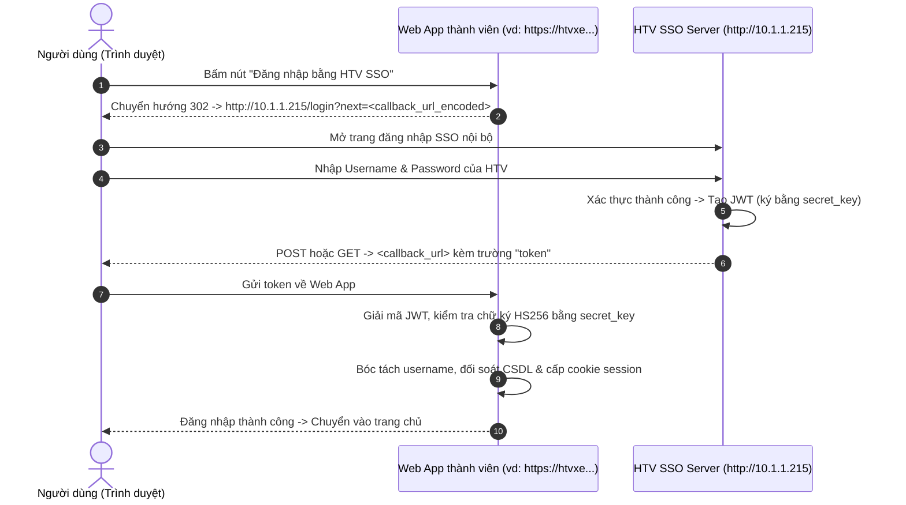

# Hướng dẫn Tích hợp HTV SSO cho các ứng dụng Web

Tài liệu này tổng hợp toàn bộ kiến trúc, quy trình, các bẫy kỹ thuật thường gặp (Gotchas) và mã nguồn mẫu chuẩn (TypeScript / Cloudflare Workers / Node.js và Python / FastAPI) để bạn có thể **tự tích hợp HTV SSO vào bất kỳ web app nào trong tương lai**.

---

## 1. Tổng quan Kiến trúc & Cơ chế hoạt động

Hệ thống HTV SSO Dashboard hoạt động theo mô hình **Single Sign-On dựa trên JWT (JSON Web Token)**:

- **Địa chỉ máy chủ SSO**: Mặc định là `http://10.1.1.215/login` (chạy trong mạng LAN nội bộ hoặc VPN Đài HTV).
- **Chuẩn mã hoá**: Token là chuỗi **JWT** có chữ ký số bí mật thuật toán **`HS256`** (HMAC-SHA256).
- **Khoá bí mật chung (`secret_key`)**: Được quy định trước và dùng chung giữa Dashboard HTV và các web app thành viên.
- **Nguyên lý phân quyền**:
  - Máy chủ SSO chịu trách nhiệm kiểm tra tài khoản & mật khẩu của người dùng.
  - Sau khi người dùng đăng nhập thành công trên SSO, Dashboard tạo một `token` JWT chứa thông tin `username` (và họ tên, đơn vị, vai trò) rồi chuyển hướng (redirect hoặc POST) về web app thành viên.
  - Web app thành viên **không cần biết và không lưu mật khẩu của người dùng trên HTV SSO**. Web app chỉ cần kiểm tra chữ ký của `token` bằng `secret_key`. Nếu chữ ký hợp lệ và token còn hạn, web app trích xuất `username`, đối soát quyền trong cơ sở dữ liệu nội bộ của app và cấp phiên đăng nhập (session).



---

## 2. Quy chuẩn Giao tiếp (API Specification)

### A. URL chuyển hướng đăng nhập
Khi người dùng bấm đăng nhập SSO, web app điều hướng trình duyệt tới:
```
http://10.1.1.215/login?next=<URL_ENCODED_CALLBACK>
```
*Ví dụ:*
Nếu URL callback của app là `https://htvxe.vncustom.workers.dev/api/auth/sso` thì URL redirect sẽ là:
```
http://10.1.1.215/login?next=https%3A%2F%2Fhtvxe.vncustom.workers.dev%2Fapi%2Fauth%2Fsso
```

### B. Endpoint nhận kết quả (Callback)
Web app cần mở một endpoint (khuyến nghị hỗ trợ cả **POST** và **GET**):
- Đường dẫn chuẩn: `/api/auth/sso` (hoặc alias `/sso`).
- Dữ liệu nhận về:
  - Nếu là **POST**: Đọc từ Form Body trường `token`.
  - Nếu là **GET**: Đọc từ Query Parameter `?token=...`.

### C. Cấu trúc Payload bên trong Token
Sau khi giải mã token JWT, phần payload thường có các trường:
```json
{
  "username": "lyhan",
  "full_name": "Lý Hân",
  "role": "nhan_vien",
  "ban": "Ban Kỹ thuật",
  "iat": 1788432000,
  "exp": 1788432300,
  "sver": 1
}
```
> [!NOTE]
> Một số phiên bản SSO có thể bọc `username` dưới dạng object `{ "username": "lyhan" }` hoặc đặt tên trường là `sub`, `name`, `user`. Hàm bóc tách username của app cần xử lý linh hoạt tất cả các trường hợp này.

---

## 3. Các "Bẫy kỹ thuật" quan trọng nhất (Gotchas)

Đây là các vấn đề thực tế đã được giải quyết triệt để trong dự án `htvxe`:

### 1. Lỗi Mixed Content & Private Network Access (HTTPS sang HTTP)
- **Vấn đề**: Các web app mới hiện nay chạy trên **HTTPS** (như Cloudflare Workers, Vercel...). Trong khi đó, Dashboard HTV chạy trên **HTTP nội bộ IP** `http://10.1.1.215`.
- **Hiện tượng**: Nếu trong trang HTML đặt link trực tiếp `<a href="http://10.1.1.215/login...">`, khi người dùng bấm vào trên Chrome/Edge, **trình duyệt sẽ âm thầm chặn lại** (bấm vào đứng yên tại chỗ không phản hồi).
- **Giải pháp chuẩn**:
  - Nút bấm trên giao diện **phải trỏ về một route tương đối cùng tên miền HTTPS**, ví dụ: `<a href="/auth/sso">`.
  - Tại route `/auth/sso`, máy chủ backend trả về lệnh **HTTP 302 Redirect** sang `http://10.1.1.215/login?next=...`. Trình duyệt luôn cho phép theo dõi lệnh 302 Redirect cấp máy chủ này.
  - Nếu muốn mở trực tiếp bằng thẻ `<a>`, bắt buộc phải có thuộc tính `target="_blank" rel="noreferrer"` để mở tab mới độc lập.

### 2. Lệch đồng hồ (Clock Skew) giữa Server Cloud và Máy chủ Nội bộ
- **Vấn đề**: Máy chủ nội bộ HTV và các máy chủ đám mây (Cloudflare / AWS) có thể lệch đồng hồ nhau từ 30 giây đến vài phút. Nếu kiểm tra chặt thời gian tạo (`iat`) hoặc thời gian hết hạn (`exp`), token sẽ bị báo lỗi "Token not yet valid" hoặc "Token expired".
- **Giải pháp**:
  - Khi xác thực JWT, **luôn cấu hình `leeway = 300` giây (5 phút)** để bù trừ sai lệch giờ.
  - Bỏ qua kiểm tra chặt `iat` (`verify_iat: false`).

### 3. Chuỗi bí mật `secret_key` bị dính dấu ngoặc kép hoặc khoảng trắng
- **Vấn đề**: Khi cấu hình biến môi trường trên Dashboard (Cloudflare, Vercel, Docker...), người dùng rất dễ copy dính dấu nháy kép `"secret"` hoặc dấu cách, xuống dòng thừa.
- **Giải pháp**:
  - Trong code backend, luôn tự động chuẩn hoá chuỗi secret: `.trim().replace(/^["']|["']$/g, "")`.

### 4. Trình duyệt cache lệnh 302 Redirect
- **Vấn đề**: Khi đăng xuất hoặc thử đăng nhập lại, trình duyệt có thể cache kết quả chuyển hướng cũ.
- **Giải pháp**:
  - Thêm timestamp vào URL chuyển hướng: `${ssoUrl}&_t=${Date.now()}`.

---

## 4. Mã nguồn mẫu chuẩn (Ready-to-Use)

### Mẫu 1: TypeScript / JavaScript (Cloudflare Workers, Hono, Node.js, Next.js)
Dùng trực tiếp chuẩn **WebCrypto API** (có sẵn trên Cloudflare Workers, Node.js 18+, Bun, Deno — không cần cài thêm thư viện ngoài):

```typescript
// sso.ts
export const DEFAULT_SSO_SERVER = "http://10.1.1.215";

function base64UrlDecode(str: string): Uint8Array {
  let b64 = str.replace(/-/g, "+").replace(/_/g, "/");
  while (b64.length % 4) b64 += "=";
  const binary = atob(b64);
  const bytes = new Uint8Array(binary.length);
  for (let i = 0; i < binary.length; i++) {
    bytes[i] = binary.charCodeAt(i);
  }
  return bytes;
}

function base64UrlDecodeText(str: string): string {
  return new TextDecoder().decode(base64UrlDecode(str));
}

export function extractSsoUsername(payload: any): string {
  if (!payload || typeof payload !== "object") return "";
  let u = payload.username;
  if (u && typeof u === "object") u = u.username || u.sub || u.name;
  if (!u || typeof u !== "string" || !u.trim()) {
    u = payload.sub || payload.name || payload.user || "";
  }
  return String(u || "").trim();
}

export async function verifySsoJwt(
  rawToken: string,
  rawSecret: string,
  leewaySeconds = 300,
): Promise<{ valid: boolean; payload?: any; username?: string; error?: string }> {
  if (!rawToken || !rawSecret) {
    return { valid: false, error: "Thiếu token hoặc secret_key." };
  }

  // Chuẩn hoá token và secret
  const token = rawToken.trim().replace(/^["']|["']$/g, "");
  const secret = rawSecret.trim().replace(/^["']|["']$/g, "");

  const parts = token.split(".");
  if (parts.length !== 3) {
    return { valid: false, error: "Định dạng JWT không hợp lệ." };
  }

  const [headerB64, payloadB64, signatureB64] = parts;

  // 1. Giải mã payload
  let payload: any = {};
  try {
    payload = JSON.parse(base64UrlDecodeText(payloadB64));
  } catch {
    return { valid: false, error: "Không thể giải mã payload." };
  }

  // 2. Xác thực chữ ký HMAC-SHA256
  try {
    const encoder = new TextEncoder();
    const key = await crypto.subtle.importKey(
      "raw",
      encoder.encode(secret),
      { name: "HMAC", hash: "SHA-256" },
      false,
      ["verify"],
    );
    const data = encoder.encode(`${headerB64}.${payloadB64}`);
    const signature = base64UrlDecode(signatureB64);
    const isValid = await crypto.subtle.verify("HMAC", key, signature, data);
    if (!isValid) {
      return { valid: false, error: "Chữ ký token không hợp lệ (sai secret_key)." };
    }
  } catch (e: any) {
    return { valid: false, error: "Lỗi xác thực: " + e.message };
  }

  // 3. Kiểm tra thời hạn (exp) có bù trừ sai lệch giờ (leeway)
  const now = Math.floor(Date.now() / 1000);
  if (payload && typeof payload.exp === "number") {
    if (now > payload.exp + leewaySeconds) {
      return { valid: false, error: "Token SSO đã hết hạn." };
    }
  }

  return { valid: true, payload, username: extractSsoUsername(payload) };
}
```

**Cách gắn Route trong ứng dụng (ví dụ Hono):**
```typescript
// 1. Chuyển hướng sang SSO
app.get("/auth/sso", (c) => {
  const callbackUrl = new URL("/api/auth/sso", c.req.url).toString();
  const ssoUrl = `http://10.1.1.215/login?next=${encodeURIComponent(callbackUrl)}&_t=${Date.now()}`;
  return c.redirect(ssoUrl, 302);
});

// 2. Nhận Callback từ SSO
app.all("/api/auth/sso", async (c) => {
  let token = "";
  if (c.req.method === "POST") {
    const form = await c.req.formData().catch(() => null);
    token = String(form?.get("token") || "");
  }
  if (!token) token = String(c.req.query("token") || "");

  const result = await verifySsoJwt(token, c.env.HTV_SSO_SECRET, 300);
  if (!result.valid || !result.username) {
    return c.text("Đăng nhập SSO thất bại: " + result.error, 401);
  }

  // Tìm username trong CSDL của app và cấp session...
  // await issueSession(c, result.username);
  return c.redirect("/home", 303);
});
```

---

### Mẫu 2: Python (FastAPI / Starlette)
Yêu cầu thư viện: `pip install PyJWT requests`

```python
import jwt
from urllib.parse import quote
from fastapi import FastAPI, Request, HTTPException
from fastapi.responses import RedirectResponse

SSO_SERVER = "http://10.1.1.215"
SSO_SECRET = "YOUR_REAL_SHARED_SECRET_KEY"

app = FastAPI()

# 1. Chuyển hướng sang SSO
@app.get("/auth/sso")
async def sso_redirect(request: Request):
    callback = str(request.base_url).rstrip("/") + "/api/auth/sso"
    login_url = f"{SSO_SERVER}/login?next={quote(callback)}"
    return RedirectResponse(url=login_url, status_code=302)

# 2. Nhận Callback từ SSO
@app.post("/api/auth/sso")
@app.get("/api/auth/sso")
async def sso_callback(request: Request):
    token = None
    if request.method == "POST":
        form = await request.form()
        token = form.get("token")
    if not token:
        token = request.query_params.get("token")

    if not token:
        raise HTTPException(status_code=400, detail="Không nhận được token.")

    try:
        # leeway=300 để bù trừ lệch đồng hồ 5 phút
        # verify_iat=False để bỏ qua kiểm tra chặt thời điểm tạo
        payload = jwt.decode(
            token,
            SSO_SECRET,
            algorithms=["HS256"],
            leeway=300,
            options={"verify_iat": False}
        )
    except jwt.InvalidTokenError as e:
        raise HTTPException(status_code=401, detail=f"Token không hợp lệ: {str(e)}")

    # Bóc tách username
    username = payload.get("username")
    if isinstance(username, dict):
        username = username.get("username") or username.get("sub")
    if not username:
        username = payload.get("sub") or payload.get("name") or "User"

    # Lưu username vào session của app
    request.session["user"] = username
    return RedirectResponse(url="/", status_code=303)
```

---

## 5. Danh sách kiểm tra khi triển khai web app mới (Checklist)

Mỗi khi bạn làm một trang web mới cần tích hợp HTV SSO:

1. [ ] **Lấy đúng `secret_key`**: Dùng đúng chuỗi bí mật thật của HTV SSO (không dùng chuỗi mẫu `HTV_SSO_SHARED_SECRET_...`).
2. [ ] **Đặt biến môi trường**: Đặt tên biến là `HTV_SSO_SECRET` trên Cloudflare / Vercel / `.env`. Kiểm tra kỹ không để dính dấu nháy kép `"` hoặc khoảng trắng.
3. [ ] **Nút bấm trên giao diện**: Trỏ link về route backend trung gian nội bộ (ví dụ `/auth/sso`), không để thẻ `<a href="http://10.1.1.215...">` trực tiếp trên trang HTTPS cùng tab.
4. [ ] **Route Backend `/auth/sso`**: Dùng lệnh điều hướng HTTP 302 Redirect sang `http://10.1.1.215/login?next=<callback_url>&_t=<timestamp>`.
5. [ ] **Route Callback `/api/auth/sso`**: Hỗ trợ đọc `token` từ cả Form Body (POST) và Query Params (GET).
6. [ ] **Giải mã JWT**: Luôn bật bù lệch giờ `leeway = 300s` (5 phút).
7. [ ] **Đối soát tài khoản**: Dùng `username` bóc tách được để truy vấn tài khoản trong CSDL riêng của app (bỏ qua mật khẩu), sau đó cấp phiên làm việc (cookie/token) của app.
